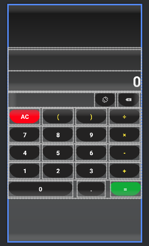
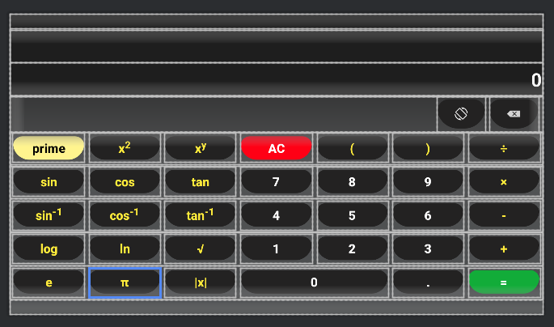
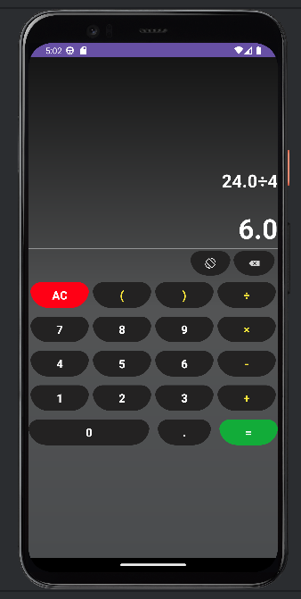
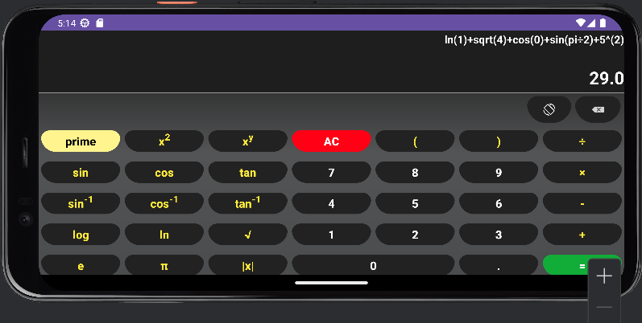

# Calculatrice Android - Projet TP
_Ce travail a été réalisé par ELHANCHIR Mohamed GLSID2 sous la supervision de M.Jamal MAWANE._

## Description
Ce projet est une application de calculatrice Android développée dans le cadre d'un travail pratique. L'application prend en charge les modes portrait et paysage, offrant une expérience utilisateur complète pour des calculs simples et avancés.

## Fonctionnalités

- **Modes portrait et paysage**
  
  

    
  

  
  

    
  

- **Opérations arithmétiques de base**
- **Fonctions scientifiques en mode paysage**
- **Effacement du dernier caractère**
- **Gestion des parenthèses**

## Déploiement
Pour tester l'application, suivez les étapes suivantes :
1. Clonez ce dépôt.
2. Ouvrez le projet dans Android Studio.
3. Exécutez l'application sur un émulateur ou un appareil Android.

##  Captures d'écran

#### Mode Portrait

  

#### Mode Paysage

  

## Contribution
Les contributions sont les bienvenues ! N'hésitez pas à ouvrir une issue ou à créer une pull request pour améliorer ce projet.

